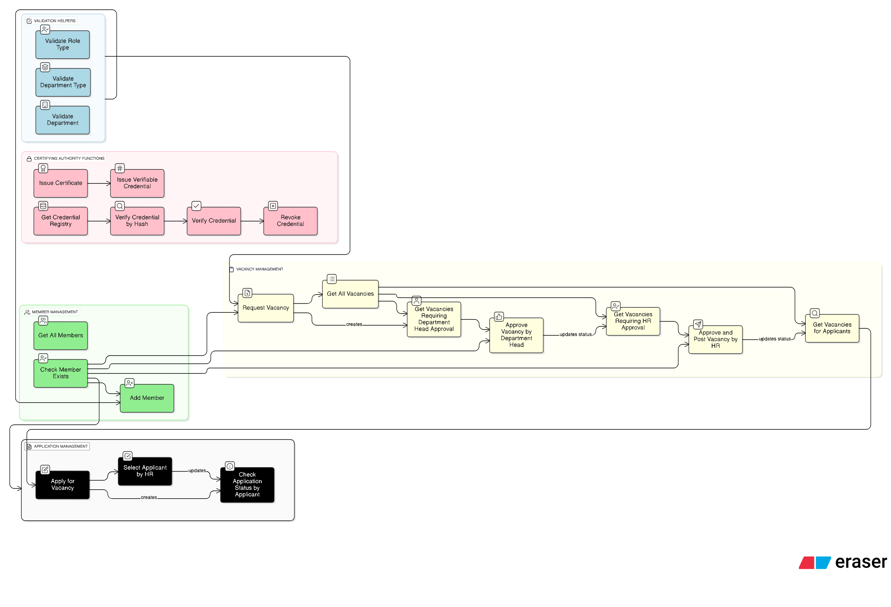
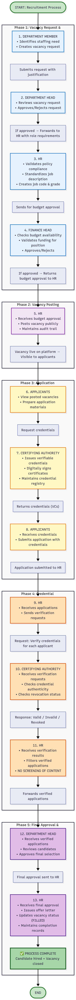

# Institute Manpower Recruitment Approval System

A terminal-based, blockchain-backed approval workflow for academic institutes handling manpower recruitment.


## Project Details
- Course: CS554 Blockchain Technologies
- Project Type: Course-Based Group Project
- Project Number: P3
- Project Name: Institute Manpower Recruitment Approval System


## Group Details (G13)

| S.No | Institute ID | Name               |
|------|--------------|--------------------|
| 1    | 1224 0420    | Bhavya Jain        |
| 2    | 1224 0430    | Bhoomi Goyal       |
| 3    | 1224 0820    | Khushi Dutta       |
| 4    | 1224 0880    | Kriti Arora        |
| 5    | 1224 0970    | Manopriya Mondal   |
| 6    | 1224 1420    | Ragini Vinay Mehta |
| 7    | 1224 1480    | Ramdeni Divya Teja |
| 8    | 1224 1720    | Shivangi Gaur      |
| 9    | 1224 1740    | Shweta Kesharwani  |
| 10   | 1224 1780    | Soni Kumari        |
| 11   | 1224 2040    | Yatika Kain        |

## Setup Instructions

### 1. Clone the Repository
```
git clone https://github.com/manopriyam/Institute-Manpower-Recruitment-Approval-System.git
```

### 2. Create Your Own Branch (Do NOT work directly on main)

```
git checkout -b <your-name>
```

### 3. Install Dependencies

```
npm install
```

### 4. Populate `.env` File

```
cp .env.example .env
```
Add your environment variables to `.env` file.

### 5. Checking Setup by Deploying `HelloWorld.sol` using `HelloWorld.js`

- #### Local Blockchain Network (Hardhat)

    - Terminal 1 — Start Hardhat Node

        ```
        npx hardhat node
        ```

    - Terminal 2 — Deploy to Localhost

        ```
        npx hardhat run scripts/HelloWorld.js --network localhost
        ```

        If successful, Terminal 1 will display mined block details.

- #### Institute Blockchain Network (IITBHILAIBLOCKCHAIN)

    ```
    npx hardhat run scripts/HelloWorld.js --network iitbhilaiBlockchain
    ```

### 6. Running Source Code by Deploying and Interacting with `main.sol` through `main.js`

- #### Local Blockchain Network (Hardhat)

    - Terminal 1 — Start Hardhat Node

        ```
        npx hardhat node
        ```

    - Terminal 2 — Deploy to Localhost

        ```
        npx hardhat run scripts/main.js --network localhost
        ```

        If successful, Terminal 1 will display mined block details.

- #### Institute Blockchain Network (IITBHILAIBLOCKCHAIN)

    ```
    npx hardhat run scripts/main.js --network iitbhilaiBlockchain
    ```


## Project Flow Charts



